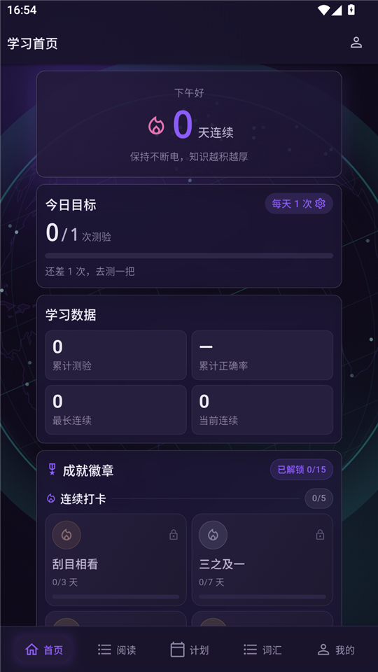
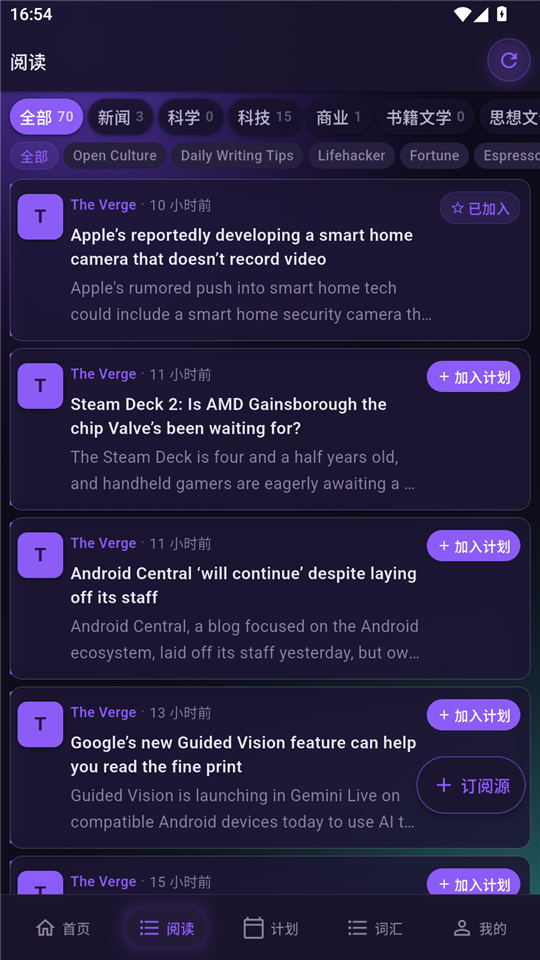
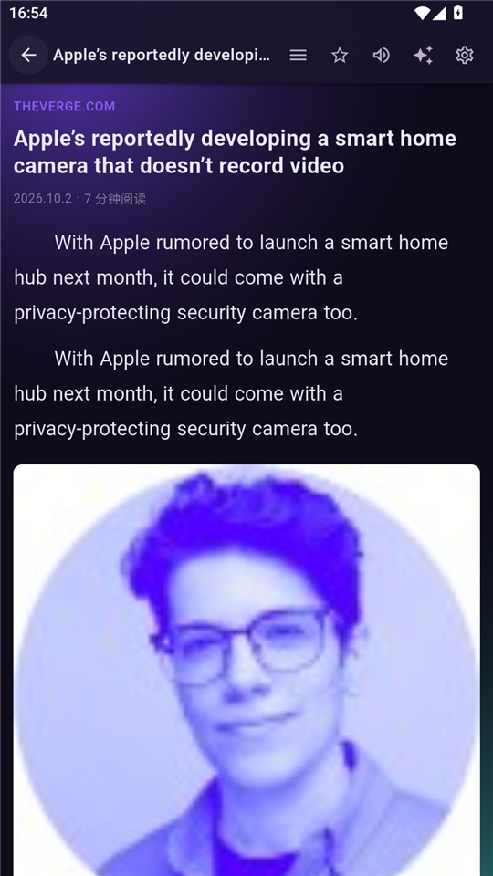
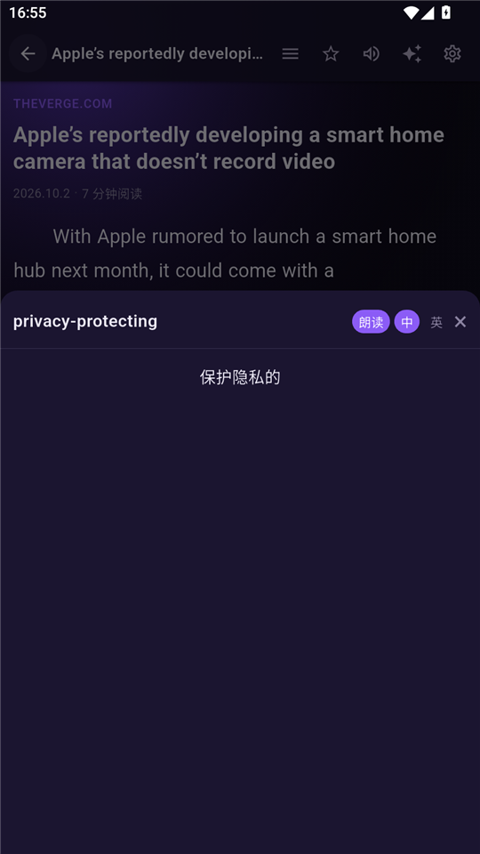
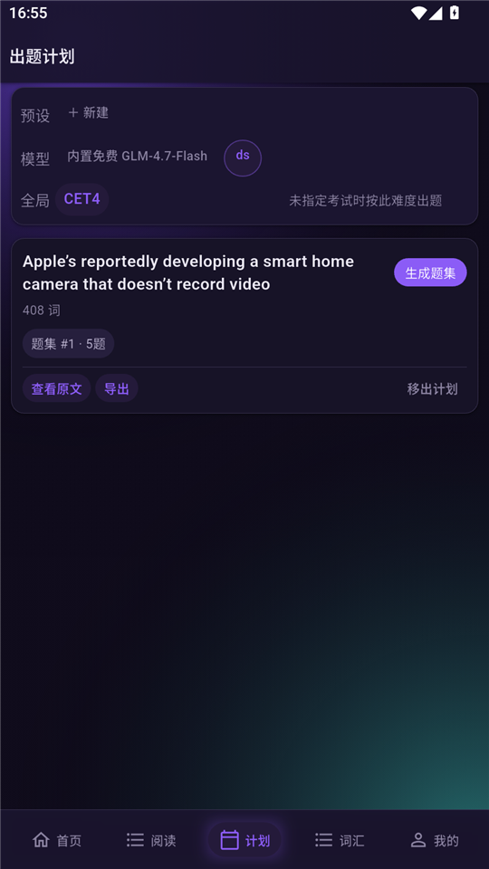
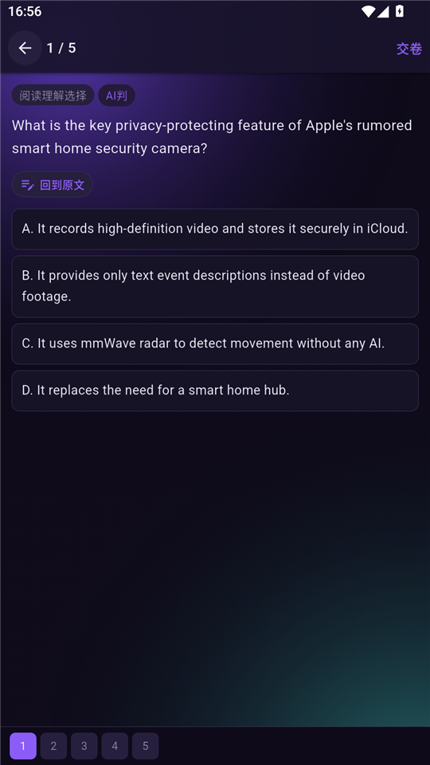
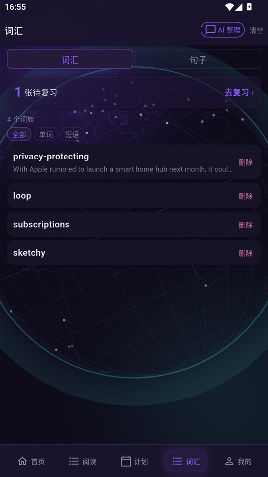
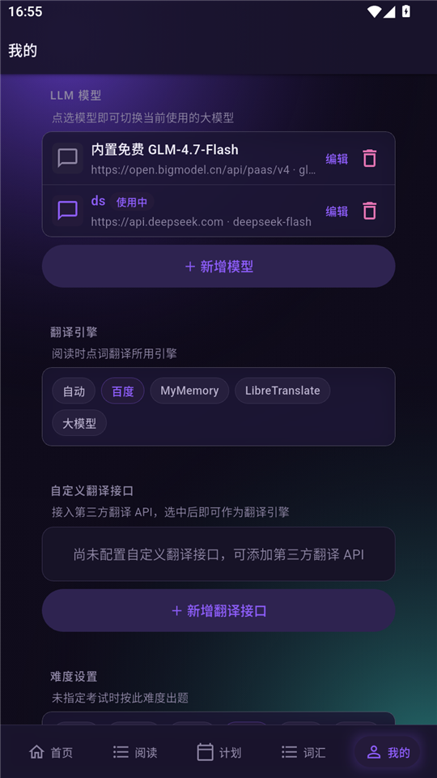

<div align="center">


<h1>GlobalOverview</h1>

<p align="center">
  一个<b>完全本地</b>的英语时文阅读 + 练习 App：订阅外刊、沉浸式阅读、AI 出题、错题本、单词本。<br/>
  没有账号，没有服务端，密钥和阅读记录全部只存在你自己的手机上。
</p>

<p align="center">
  <a href="LICENSE"></a>
  
  
  
  
  
</p>

</div>

---

## 界面预览

| 学习首页 | 阅读 | 沉浸式阅读器 |
| :---: | :---: | :---: |
|  |  |  |

| 点词查词 | 出题计划 | 答题 |
| :---: | :---: | :---: |
|  |  |  |

| 单词本 | 我的 |
| :---: | :---: |
|  |  |

---

## 说在前面

> 又到了假期，不知为何每次放假后，紧绷的弦突然松开时，我都会感到空虚，上学时如果明明要我说去玩什么的话我能说出一大串来，但放了假后明明有时间玩了，而我却什么连想玩什么都不知道了。
>
> 既然不知道玩什么，那就写点题吧，指尖划过屏幕，在 pdd 上敲下“英语时文阅读”几个字。随之出现在眼前的，不是软件图标，而是一堆数字。
>
> 我愣了一下，想起了那些发黄的纸币。或许，在我身后柜子里还有几张，十几张那样的纸币。可是，那又够我在求学路上支撑多久呢？
>
> 突然有一天我的朋友找到我问我这个暑假还写项目吗，此时，我看到了一束光。那束光，是家中台式电脑电源按钮的微光，我好似看到了希望。
>
> 我想起了我的项目，想起了我在上上个寒假开发 `OJ` 的日日夜夜，想起了我与朋友一同开发的日子。我觉得忏悔，为什么面对忙碌而又空虚的假期，我没有早点想起我还能继续开发，可能是因为我已经上课上麻木了吧。
>
> 受 [ReadYou](https://github.com/ReadYouApp/ReadYou) 等 `RSS` 阅读器的启发，一个大胆的念头出现在我的脑海之中，我要自己手搓一个英语时文阅读器。于是我连忙拉上了一位英语更不好的英语课代表一起，准备这项伟大的工程。
>
> 完全的免费，完全的自由，完全的希望！不，是取之不尽的，用之不竭的！
>
> 这次，我的手指在触感真实而又熟悉的黑色键盘上，回味着往事。在经过漫长的开发和调试之后，在我几乎想要放弃之际，终于我看到了方向。
>
> 那里，有一座望远镜，和一个地球。
>
> 紧接着，一系列的文章，星罗棋布，或许是望远镜观察到的吧。轻点做题，有选择，填空，简答。作答时虚无缥缈的手机屏幕键盘也好似有了力量，闪烁着，跳跃着，好似希望的火苗。
>
> 平时阅读时，我便会轻点屏幕，那些晦涩难懂的短语、单词的释义便会跃然屏幕上，加入单词本中供我积累。
>
> 此时，窗外正是一半晴一半阴。
>
> “朝晖夕阴，气象万千。”我不禁吟诵道，看着眼前的另一轮朝阳照亮了英语之路，我隐隐地笑了。
>
> 以上，致我的一个暑假。
>
> 本人拙笔，请见谅。

> [!NOTE]
> 本项目最初基于 `uni-app`（`Vue3` + `Vite`）实现，源码保留在 [`legacy/`](legacy) 目录，仅作历史留档。**当前版本（`v3.0.0`）已用 Flutter + Dart 完全重写**，界面与交互都重新实现了一遍，仅在业务流程和视觉语言上延续了原版的设计。

> [!NOTE]
> 本项目的界面与业务实现基本由 `LLM` 辅助完成，本人主要负责提出需求、验证结果和反复调教。参考过 [ReadYou](https://github.com/ReadYouApp/ReadYou) 等开源项目的功能设计。

> [!NOTE]
> 目前**仅支持 `Android`**。理论上 `iOS` 也可以适配，但本人对 `iOS` 不熟且开发者年费有点高，故暂不考虑。

> [!NOTE]
> 作为一个 `OIer`, 本人没有过多精力对此项目进行长期维护，欢迎各位贡献者支持。

---

## 功能

- **订阅与阅读**

  - 内置 **86 个 `RSS` 源 / 17 个分类**（新闻、科学、健康、科技、商业、环境、食物、艺术、设计、书籍文学、思想文化、英语学习、体育、旅行、教育、政策智库、生活），首次启动默认订阅 14 个。
  - 下拉刷新、分类导航、按源筛选、加载更多；支持手动添加自建源。

- **沉浸式阅读器**

  - 字号 / 行距可调，行距与字号本地记忆。
  - **点词查词**、**长按整句**取句、工具栏「选择」可点选多词整段翻译。
  - 正文插图渲染（加载失败自动重试，仍失败则降级为占位块）。
  - **朗读**：调用系统原生 `TTS`，可朗读全文 / 选句 / 单词卡。

- **AI 精选**

  `LLM` 把长文压成精读版，可随时切回原文、重新精选或删除，并给出「段落数 / 字数」的精简摘要；出题可基于精选版。

- **计划 → 题集**

  - 文章「加入计划」→ 计划页选预设或临时表单（考试对标 / 题型 / 数量 / 解析语言）。
  - 内置 **13 种题型**：完形填空、阅读理解选择、语法填空、信息匹配、判断正误、句子排序、概要写作、英译中、中译英、词汇运用、短语填空、句子改写、开放性问答。
  - 答题：**一屏一题 + 左右滑动**，底部题号可随时跳转，「回到原文」对照原文核查，交卷后 `LLM` 批量评分并给出解析。

- **错题本**

  做错自动汇入，可独立重做 / 导出。

- **单词本**

  阅读中点词自动沉淀，记录出现次数与原句出处；内置复习评分（忘记 / 模糊 / 记得）。

- **成就与打卡**

  连续天数、每日达标目标、**15 枚成就徽章**（连续打卡 / 累计测验 / 正确率 / 满分测验 / 超额完成），青铜 → 白银 → 黄金 → 钻石四档。

- **导出 `PDF`**

  生成 `HTML` 模板 → 调用系统打印（可另存为 `PDF`）。

- **`LLM` 配置**

  自行填写 `base_url` / `api key` / 模型名，内置免费兜底配置；密钥只写入本地 `shared_preferences`，可一键测试连通性。

- **自定义翻译接口**

  可添加第三方翻译 `API` 作为备用翻译管道。

- **其它**

  深色主题 + 地球动效背景、跨页数据变更信号（任一页写入，其余页即时刷新）。

---

## 技术栈

- `Flutter 3.47` / `Dart 3.13`
- `Riverpod 3`（Provider + Notifier 变更信号）
- `sqflite`（本地数据）
- `http`
- `xml`（`RSS` 解析）
- `html`（正文抽取）
- `printing` + `pdf`（导出）
- `flutter_tts`（朗读）
- `shared_preferences`（配置与密钥）
- `crypto` + `uuid`
- `flutter_lints` + `flutter_test`

设计走自建 token 体系（`lib/theme/go_tokens.dart` 的 `Go.*`），组件集中在 `lib/widgets/`，页面只做组合。

---

## 项目结构

```text
lib/
  main.dart                  入口、主题、路由与 5 个 Tab（首页/阅读/计划/词汇/我的）
  app_info.dart              版本号
  models/models.dart         数据模型
  providers/providers.dart   Riverpod 提供者 + 各页面刷新信号
  services/                  17 个服务：RSS / 正文抽取 / 题库 / 判分 / 词汇 / 复习 / 翻译
                             / TTS / 导出 / 成就打卡 / 配置…
  screens/                   12 个页面
  theme/                     设计 token（Go.*）与深浅主题
  widgets/                   通用组件（GoCard / GoBtn / GoEmpty / GoPage…）、图标、底部导航、地球背景
test/                        12 个测试文件（widget 测试 + 单元测试，共 17 个用例）
legacy/                      旧版 uni-app + Vue3 源码（v2.x，仅作历史留档）
assets/                      应用图标与世界地图 GeoJSON
docs/screenshots/            README 界面预览截图
```

---

## 开发

环境：Flutter `3.47.5`（stable）、Android SDK、JDK 17。

```bash
flutter pub get
flutter run                      # 连真机 / 模拟器运行
flutter test                     # 跑全部测试
flutter analyze                  # 静态分析
flutter build apk --release      # 产物：build/app/outputs/flutter-apk/app-release.apk
```

几点说明：

- 仅支持 `Android`，`applicationId` 为 `com.github.overviewsoftware.globaloverview`。
- `debug` 与 `release` **复用 `legacy/key.jks` 同一套签名**，因此新版可以直接覆盖安装老版 App，用户数据不丢。
- 朗读依赖系统 `TTS`：`Android 11+` 需要在 `AndroidManifest.xml` 的 `<queries>` 中声明 `android.intent.action.TTS_SERVICE`（仓库里已声明，升级 Flutter 插件后请留意别被覆盖）。
- `LLM` 的 `api key` 只存在本地；首次使用请到「我的 → LLM 模型」里配置并测试连通性。
- 写界面时注意：**别给可能放大的文字套固定高度**，系统字号放大后会被裁切（本项目已因此踩坑两次，测试里有对应回归用例）。

---

## TODO

1. 浅色主题切换入口（深浅主题均已实现，暂缺 `UI` 开关）
2. `iOS` 适配
3. 性能优化（长列表、大批量导出）
4. 错题 / 单词与复习计划联动
5. 文章过滤器（按关键词、来源、时间筛选）
6. 离线词库：更准的词频、音标与释义来源

---

## 致谢

最后感谢本项目的所有贡献者，特别感谢 ShaDouBuShi123 为本项目提供的图标和大力支持。
